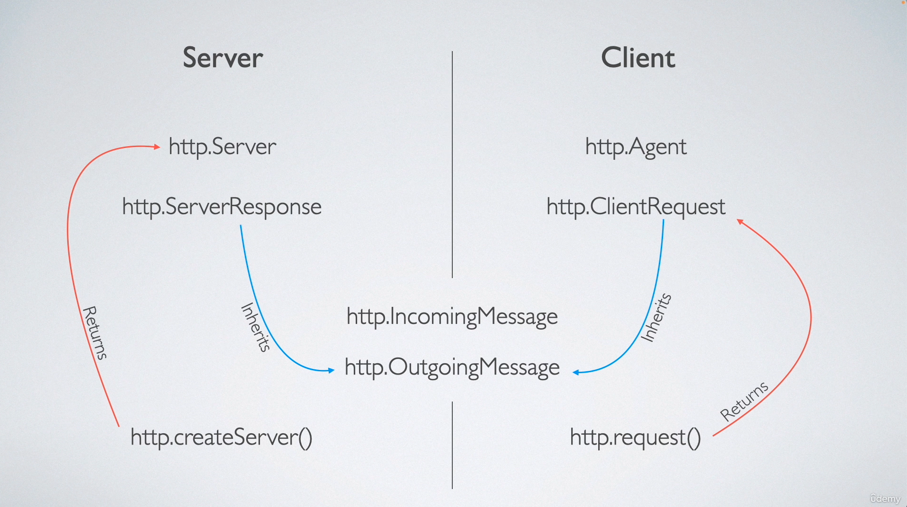

# Node.js HTTP Module — Docs At A Glance 🧠

---

## 🔥 HTTP কি Node.js এ?

Node.js এ HTTP module built-in — যার মাধ্যমে তুমি সহজে HTTP server/client বানাতে পারো।

> Protocol: HTTP  
> Module: `http`  
> Layer: Application Layer (on top of TCP)

---

## 🧩 Core Concepts:

HTTP Module দুই ভাগে ভাগ:

### 🚀 Server Side:
| Component | Description |
|-----------|-------------|
| `http.Server` | Represents the HTTP server itself. Created using `http.createServer()` |
| `http.ServerResponse` | Represents the outgoing response from the server to the client |
| `http.IncomingMessage` | Represents the incoming request from client |

Example:
```js
const http = require('http');

const server = http.createServer((req, res) => {
  console.log(req.method, req.url); // IncomingMessage
  res.writeHead(200, { 'Content-Type': 'text/plain' }); // ServerResponse
  res.end('Hello World!');
});

server.listen(3000, () => console.log('Server running'));


⸻

🌐 Client Side:

Component	Description
http.ClientRequest	Represents the request being sent from client
http.Agent	Manages connection pooling and reuse

Example:

const http = require('http');

const options = {
  hostname: 'example.com',
  port: 80,
  path: '/',
  method: 'GET'
};

const req = http.request(options, res => {
  console.log(`Status Code: ${res.statusCode}`);
  res.on('data', chunk => {
    console.log(`Body: ${chunk}`);
  });
});

req.end();


⸻

🔧 Common Classes:

Class	Role
http.IncomingMessage	Represents readable stream from client (used in server)
http.OutgoingMessage	Base class of ServerResponse and ClientRequest

All request/response objects inherit from stream!

⸻

🛠️ API Methods (Most Used)

Method	Purpose
http.createServer()	Creates an HTTP server
http.request()	Sends HTTP request (like GET, POST)
http.get()	Shortcut for GET request
req.end()	Finalize and send request
res.write()	Write data to response
res.end()	Finalize and send response


⸻

🧠 Real World Use Case:
	1.	REST API Server
	2.	Webhook Receiver
	3.	Proxy Server
	4.	Custom HTTP Client (like Axios but raw)

⸻

⚠️ Bonus Tips:
	•	Use http.createServer() for building server
	•	Use http.request() if you want raw low-level control over client requests (alternatively use axios or fetch in high-level code)
	•	All HTTP objects (req/res) are stream-based (Readable/Writable)

⸻

🔚 Summary
	•	http.Server = HTTP Server
	•	http.ServerResponse = Response object (to send back)
	•	http.ClientRequest = For sending request to another server
	•	http.Agent = Connection manager
	•	Everything under the hood uses stream!

---

