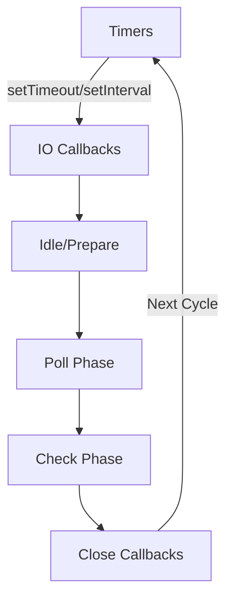

# Node.js Under the Hood

## গুরুত্বপূর্ণ নোটস:

### JavaScript এবং Machine Code
- **JavaScript** একটি **High-level Language**, যা সরাসরি **hardware-level** এ কাজ করতে পারে না। 
- যদি hardware-level এ কাজ করতে হয়, তাহলে **C/C++** ব্যবহার করতে হয়।
- JavaScript কোড **machine code** এ **convert** হতে হয়, কারণ **machine** শুধুমাত্র **binary (0s and 1s)** বোঝে।
- **Assembler** - **Assembly Language** কে **Machine Code** এ রূপান্তর করে।
- **Compiler (e.g., GCC)** - **C/C++** কোড কে **Machine Code** এ রূপান্তর করে।
- **JavaScript Engine** - JavaScript কে **Machine Code** এ **convert** করার জন্য ব্যবহৃত হয়।

### JavaScript Engine
- **V8 Engine** → Google ডেভেলপ করেছে **Chrome Browser** এর জন্য।
- **Brendan Eich** V8 ইঞ্জিন ব্যবহার করে **Node.js** তৈরি করেন।
- **V8 Engine** কেন দ্রুত?
  - এটি **direct machine code** এ **convert** করে।
  - **JIT Compilation (Just-In-Time Compilation)** ব্যবহার করে।
- **SpiderMonkey** → Mozilla ডেভেলপ করেছে **Firefox Browser** এর জন্য।
  - এটি **Interpreter + JIT Compiler** ব্যবহার করে।

---

## Libuv

### কী?
- **Libuv** একটি **C library**, যা **Node.js** কে **asynchronous, non-blocking I/O** অপারেশন পরিচালনা করতে সাহায্য করে।
- মূলত **event-driven** এবং **multi-platform support** নিশ্চিত করার জন্য ব্যবহৃত হয়।

### কাজ কী?
- **Event Loop** পরিচালনা করে।
- **Thread Pool** হ্যান্ডেল করে।
- **Filesystem I/O** (File Read/Write) পরিচালনা করে।
- **Networking (TCP, UDP, DNS, HTTP)** হ্যান্ডেল করে।
- **Process Management (Child Process, Signal Handling)** পরিচালনা করে।
- **Timers (setTimeout, setInterval, setImmediate)** পরিচালনা করে।

### কেন দরকার?
- **Node.js single-threaded**, কিন্তু Libuv এর মাধ্যমে **multi-threading** এর সুবিধা নেওয়া যায়।
- **Blocking operations (e.g., file system, network requests)** আলাদা **Thread Pool** এ পাঠানো হয়, যাতে **main thread (event loop)** ব্লক না হয়।

---

## Thread কী?
- **Thread** হল **execution unit**, যা একটি প্রসেসের মধ্যে কাজ করে।
- Node.js **single-threaded**, কিন্তু Libuv **Thread Pool** ব্যবহার করে **heavy tasks** পরিচালনা করতে পারে।
- **CPU-intensive tasks** (e.g., image processing, cryptography) করলে **default 4 threads** কম পড়ে যেতে পারে।

### Thread কখন বাড়াতে হয়?
- যদি **I/O-intensive** কাজ বেশি থাকে, তাহলে বাড়ানোর দরকার হয় না, কারণ এগুলো **event loop** দ্বারা পরিচালিত হয়।
- কিন্তু **CPU-intensive tasks** বেশি হলে **UV_THREADPOOL_SIZE** বাড়ানো দরকার।

```js
process.env.UV_THREADPOOL_SIZE = 8; // Default 4, Increase to 8
```

### Real-life Example
- ধরো তুমি একটি **restaurant** চালাচ্ছো, যেখানে **একজন ওয়েটার** (single-thread) অর্ডার নিচ্ছে। যদি **একসাথে অনেক গেস্ট আসে**, তাহলে **ওয়েটার একা সব manage করতে পারবে না**। তাই **অতিরিক্ত ওয়েটার (extra threads) নিয়োগ দিতে হবে**, যাতে অর্ডার নেওয়া দ্রুত হয়।

---

## Non-blocking I/O কী?
- **Blocking I/O** → যখন একটি I/O অপারেশন চলবে, তখন **পুরো প্রোগ্রাম থেমে থাকবে** যতক্ষণ না কাজ শেষ হয়।
- **Non-blocking I/O** → I/O অপারেশন চলাকালীন **অন্য কাজ চলতে পারে**।
- **Node.js non-blocking I/O ব্যবহার করে**, যার কারণে এটি **high-performance এবং scalable**।

```js
const fs = require('fs');

// Blocking I/O
const data = fs.readFileSync('file.txt', 'utf-8');
console.log(data);

// Non-blocking I/O
fs.readFile('file.txt', 'utf-8', (err, data) => {
    if (err) throw err;
    console.log(data);
});
```

---

## Thread Pool কী?
- **Thread Pool** হল **pre-created threads** এর একটি **পুল**, যা **heavy I/O tasks** পরিচালনার জন্য ব্যবহৃত হয়।
- **Node.js এর Libuv** **default 4 threads** ব্যবহার করে।
- এটি **background কাজ** দ্রুত করার জন্য ব্যবহার করা হয়।

### ব্যবহার
- **File System Operations**
- **Cryptography (bcrypt, hashing, encryption)**
- **Database Queries (MongoDB, MySQL, PostgreSQL)**
- **Image Processing (Sharp, Jimp)**

---

## Event-driven কী?
- **Event-driven architecture** এর মূল ধারণা হলো **events (ঘটনা)** এর উপর ভিত্তি করে কাজ করা।
- **Node.js asynchronous & event-driven**, যার মানে **একটি কাজ শেষ না হওয়া পর্যন্ত অপেক্ষা না করে অন্য কাজ চালিয়ে যায়**।
- **Callback functions, Promises, এবং Async/Await** ব্যবহার করে **event-driven** পদ্ধতিতে কাজ করা হয়।

### Real-life Example
- ধরো, তুমি **YouTube Live Streaming** দেখছো। যখন **নতুন কমেন্ট আসে**, সেটি **real-time এ display** হয়, কিন্তু পুরোনো কমেন্ট লোড হওয়া পর্যন্ত পুরো স্ক্রিন freeze হয় না। এটি **event-driven** মডেলের একটি উদাহরণ।

---

### Event Loop এবং Libuv
- **Node.js এর heart হল Event Loop**।
- **Libuv** **Event Loop** পরিচালনা করে এবং **I/O tasks, timers, network requests** হ্যান্ডেল করে।
- **Phases of Event Loop:**
  1. **Timers Phase** → setTimeout(), setInterval() execute করে।
  2. **I/O Callbacks Phase** → Network I/O callbacks execute করে।
  3. **Idle/Prepare Phase** → Internal operations পরিচালিত হয়।
  4. **Poll Phase** → I/O Events process হয়।
  5. **Check Phase** → setImmediate() execute করে।
  6. **Close Callbacks Phase** → Sockets বা resources release করে।



---

### সংক্ষেপে
- **V8 Engine** → **JavaScript** কে **machine code** এ **convert** করে।
- **Libuv** → **Asynchronous I/O, Event Loop, Thread Pool** পরিচালনা করে।
- **Event Loop** → **Non-blocking execution** নিশ্চিত করে।
- **Thread Pool** → **Heavy I/O operations** দ্রুত করে।
- **Event-driven Architecture** → **Scalable & high-performance applications** তৈরি করে।

