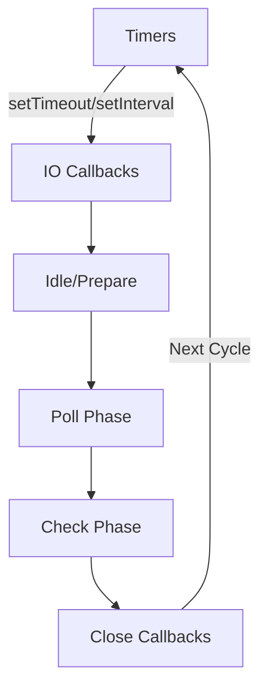

# Node.js Under the Hood

## গুরুত্বপূর্ণ নোটস:

### JavaScript এবং Machine Code
- **JavaScript** একটি **High-level Language**, যা সরাসরি **hardware-level** এ কাজ করতে পারে না। 
- যদি hardware-level এ কাজ করতে হয়, তাহলে **C/C++** ব্যবহার করতে হয়।
- JavaScript কোড **machine code** এ **convert** হতে হয়, কারণ **machine** শুধুমাত্র **binary (0s and 1s)** বোঝে।
- **Assembler** - **Assembly Language** কে **Machine Code** এ রূপান্তর করে।
- **Compiler (e.g., GCC)** - **C/C++** কোড কে **Machine Code** এ রূপান্তর করে।
- **JavaScript Engine** - JavaScript কে **Machine Code** এ **convert** করার জন্য ব্যবহৃত হয়।

### JavaScript Engine
- **V8 Engine** → Google ডেভেলপ করেছে **Chrome Browser** এর জন্য।
- **Brendan Eich** V8 ইঞ্জিন ব্যবহার করে **Node.js** তৈরি করেন।
- **V8 Engine** কেন দ্রুত?
  - এটি **direct machine code** এ **convert** করে।
  - **JIT Compilation (Just-In-Time Compilation)** ব্যবহার করে।
- **SpiderMonkey** → Mozilla ডেভেলপ করেছে **Firefox Browser** এর জন্য।
  - এটি **Interpreter + JIT Compiler** ব্যবহার করে।

---

## Libuv

### কী?
- **Libuv** একটি **C library**, যা **Node.js** কে **asynchronous, non-blocking I/O** অপারেশন পরিচালনা করতে সাহায্য করে।
- মূলত **event-driven** এবং **multi-platform support** নিশ্চিত করার জন্য ব্যবহৃত হয়।

### কাজ কী?
- **Event Loop** পরিচালনা করে।
- **Thread Pool** হ্যান্ডেল করে।
- **Filesystem I/O** (File Read/Write) পরিচালনা করে।
- **Networking (TCP, UDP, DNS, HTTP)** হ্যান্ডেল করে।
- **Process Management (Child Process, Signal Handling)** পরিচালনা করে।
- **Timers (setTimeout, setInterval, setImmediate)** পরিচালনা করে।

### কেন দরকার?
- **Node.js single-threaded**, কিন্তু Libuv এর মাধ্যমে **multi-threading** এর সুবিধা নেওয়া যায়।
- **Blocking operations (e.g., file system, network requests)** আলাদা **Thread Pool** এ পাঠানো হয়, যাতে **main thread (event loop)** ব্লক না হয়।

### Thread Pool
- Libuv **Thread Pool** ব্যবহার করে **heavy I/O operations** পরিচালনা করতে পারে।
- Default **4 threads** থাকে, কিন্তু চাইলে **UV_THREADPOOL_SIZE** পরিবর্তন করা যায়।

```js
process.env.UV_THREADPOOL_SIZE = 8; // Default 4, Increase to 8
```

### Event Loop এবং Libuv
- **Node.js এর heart হল Event Loop**।
- **Libuv** **Event Loop** পরিচালনা করে এবং **I/O tasks, timers, network requests** হ্যান্ডেল করে।
- **Phases of Event Loop:**
  1. **Timers Phase** → setTimeout(), setInterval() execute করে।
  2. **I/O Callbacks Phase** → Network I/O callbacks execute করে।
  3. **Idle/Prepare Phase** → Internal operations পরিচালিত হয়।
  4. **Poll Phase** → I/O Events process হয়।
  5. **Check Phase** → setImmediate() execute করে।
  6. **Close Callbacks Phase** → Sockets বা resources release করে।



---

### সংক্ষেপে
- **V8 Engine** → **JavaScript** কে **machine code** এ **convert** করে।
- **Libuv** → **Asynchronous I/O, Event Loop, Thread Pool** পরিচালনা করে।
- **Event Loop** → **Non-blocking execution** নিশ্চিত করে।

